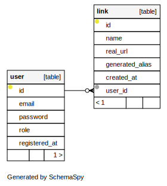

<p align="center">
 
</p>

[](https://github.com/WenzzyX/go-ushort/actions/workflows/ci-cd.production.yml)
&nbsp;\
My pet project that shortens long links ;)\
&nbsp;\
_`https://very-long-site-subdomain.long-domain-ffff.com/my-best-blog`_ \
-> `https://ushort.bio/g32d` \
_ushort.bio - is not my domain, it's just an example_

## Todo

- [x] JWT Authentication (access,refresh)
- [x] Create/update link by user
- [X] Configure JSON-only logger on IsProduction mode
- [x] Create script (alias) for migration creation
- [x] Add pagination for links
- [x] Add a collection of metrics and a dashboard to monitor them (prom-app -> victoriametrics -> grafana)
- [x] Add LICENSE
- [x] Write tests
- [x] Write the rules for making a contribution
- [x] Change db diagram svg generation (replace images)
- [x] Configure CI/CD
- [x] Configure dev_full docker-compose 
- [ ] Configure git-crypt
- [ ] Configure deploy (heroku or other service)
- [ ] Link domain


For simple run scripts - make alias `alias gr="sh run.sh"`

### General

```shell
gr
# or `sh run.sh`
# Get list of scripts and description for each script
```

### Environment

#### Server config

| param                     | type      | required | default   | description                                                      |
---------------------------|-----------|----------|-----------|------------------------------------------------------------------|
| `JWT_ACCESS_SECRET`       | `string`  | `yes`    | `-`       | Secret for generating accessToken                                |
| `JWT_ACCESS_EXP_TIME`     | `string`  | `yes`    | `-`       | life duration of accessToken (ex.: "20s", "2d")                  |
| `JWT_REFRESH_SECRET`      | `string`  | `yes`    | `-`       | Secret for generating refreshToken                               |
| `JWT_REFRESH_EXP_TIME`    | `string`  | `yes`    | `-`       | life duration of accessToken (ex.: "20s", "2d")                  |
| `IS_PRODUCTION`           | `boolean` | `no`     | `true`    | Run-mode is production? (ex.: "true")                            |
| `IS_DEBUG`                | `boolean` | `no`     | `false`   | Print sensitive info and prettify log messages? (ex.: "true")    |
| `IS_ENABLE_PROM`          | `boolean` | `no`     | `false`   | Enable prometheus? (ex.: "false")                                |
| `DOMAIN`                  | `string`  | `yes`    | `-`       | Domain for setting cookies (ex.: "localhost")                    |
| `ALLOWED_HOSTS`           | `string`  | `no`     | `0.0.0.0` | Hosts who can send requst to server (ex.: "0.0.0.0,192.168.1.1") |
| `SERVER_HOST`             | `string`  | `no`     | `0.0.0.0` | Host, where server will run (ex.: "0.0.0.0")                     |
| `LIMIT_COUNT_PER_REQUEST` | `int`     | `no`     | `10`      | _Temporarly not using_                                           |

&nbsp;\
&nbsp;

#### Database config

| param             | type      | required | default                      | description                                                      |
-------------------|-----------|----------|------------------------------|------------------------------------------------------------------|
| `DB_NAME`         | `string`  | `yes`    | `-`                          | DB name                                                          |
| `DB_USER`         | `string`  | `yes`    | `-`                          | DB user                                                          |
| `DB_PASS`         | `string`  | `yes`    | `-`                          | DB password                                                      |
| `DB_HOST`         | `string`  | `no`     | `localhost`                  | DB host (ex.: "localhost")                                       |
| `DB_PORT`         | `int`     | `no`     | `5432`                       | DB port   (ex.: "5432")                                          |
| `DB_LOG_MODE`     | `boolean` | `no`     | `false`                      | Output SQL and other query information? (ex.: "true")            |
| `DB_SSL_MODE`     | `string`  | `no`     | `false`                      | Use SSL mode (ex.: "disable", "enable")                          |
| `MIGRATIONS_PATH` | `string`  | `no`     | `./app/common/database/migrations` | Migrations folder path (ex.: "./app/common/database/migrations") |


### Database diagram
